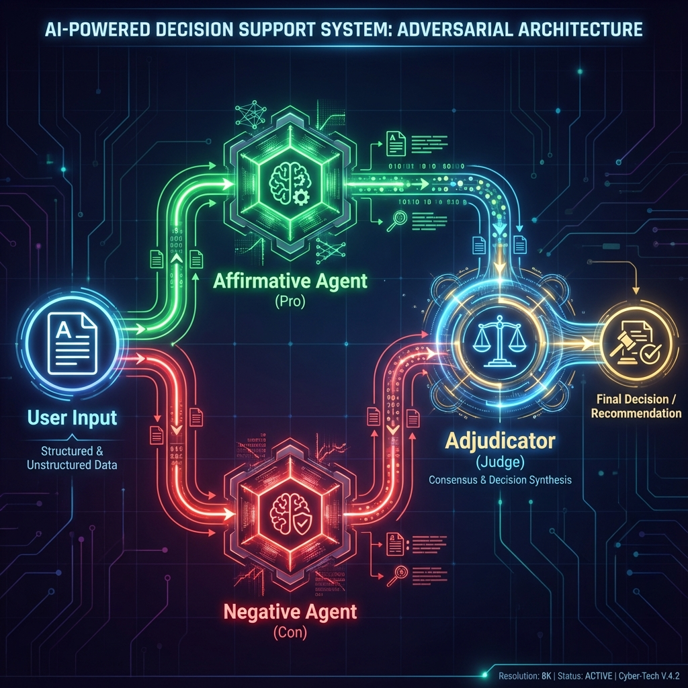

<p align="center">
  
  
  
</p>

<h1 align="center">
  <br>
  🎭 Dialecta
  <br>
</h1>

<h4 align="center">Multi-Persona AI Debate System — 多角色 AI 辩论系统</h4>

<p align="center">
  通过<b>正反方对抗辩论</b> + <b>AI 裁决</b>的工作流，克服单一 LLM 的幻觉和盲目顺从问题。
</p>

---

## ✨ Features

- 🔄 **Multi-Persona Debate** — 正方支持、反方反驳、裁决方综合判断
- 🔀 **Parallel Execution** — 正反方并行生成，提升效率
- 🌊 **Streaming Output** — 实时流式输出，所见即所得
- 🎨 **Modern CLI** — 科技感 UI，丰富的颜色和视觉元素
- 🔌 **Multi-Provider** — 支持 DeepSeek、Gemini、DashScope (Qwen)
- ⚙️ **Flexible Config** — 每个角色可独立配置不同的 Provider 和 Model
- 🎯 **8 Model Combinations** — 交互模式提供 8 种预设模型组合，快速选择
- 📝 **Structured Input** — 交互模式支持问题+上下文文件的结构化输入

## 🏗️ Architecture



## 🚀 Quick Start

### Installation

```bash
# Clone the repository
git clone https://github.com/hrygo/dialecta.git
cd dialecta

# Build
make build

# Or install globally
make install
```

### Environment Setup

```bash
# Set API keys (configure based on your providers)
export DEEPSEEK_API_KEY="your-deepseek-api-key"
export GEMINI_API_KEY="your-gemini-api-key"        # or GOOGLE_API_KEY
export DASHSCOPE_API_KEY="your-dashscope-api-key"
```

### Usage

```bash
# Analyze a file
dialecta proposal.md

# Read from stdin
echo "我们应该启动 AI 创业项目" | dialecta -

# Interactive mode (with structured input support)
dialecta --interactive
dialecta -i             # Short form
# Features: Model selection + Question + Optional context file

# Quick access with Make commands
make ui                    # Interactive mode with 8 model combinations
make gemini                # All Gemini (Pro, Con, Judge)
make gemini-deepseek       # Gemini Judge, DeepSeek debate
make gemini-qwen           # Gemini Judge, Qwen debate  
make deepseek-qwen         # Gemini Judge, DeepSeek vs Qwen

# Custom providers
dialecta --pro-provider deepseek --con-provider dashscope --judge-provider gemini doc.md
```

## ⚙️ Configuration

### Supported Providers

| Provider  | Environment Variable                | Default Model           | Description       |
| --------- | ----------------------------------- | ----------------------- | ----------------- |
| DeepSeek  | `DEEPSEEK_API_KEY`                  | `deepseek-chat`         | DeepSeek Chat API |
| Gemini    | `GEMINI_API_KEY` / `GOOGLE_API_KEY` | `gemini-3-pro-preview`  | Google Gemini API |
| DashScope | `DASHSCOPE_API_KEY`                 | `qwen-plus`             | Alibaba Qwen API  |

### Default Role Configuration

| Role        | Provider  | Model                   | Temperature |
| ----------- | --------- | ----------------------- | ----------- |
| Affirmative | DeepSeek  | `deepseek-chat`         | 0.8         |
| Negative    | DashScope | `qwen-plus`             | 0.8         |
| Adjudicator | Gemini    | `gemini-3-pro-preview`  | 0.1         |

### Interactive Mode Combinations

When using `dialecta -i` or `make ui`, you can choose from 8 model combinations:

| ID | Combination | Judge | Pro | Con | Description |
|----|-------------|-------|-----|-----|-------------|
| 1 | All Gemini | Gemini | Gemini | Gemini | Highest quality analysis |
| 2 | Gemini Judge, DeepSeek Debate | Gemini | DeepSeek | DeepSeek | Gemini judgment + DeepSeek reasoning |
| 3 | Gemini Judge, DeepSeek vs Qwen | Gemini | DeepSeek | Qwen | Mixed debate perspectives |
| 4 | Gemini Judge, Qwen Debate | Gemini | Qwen | Qwen | Gemini judgment + Qwen debate |
| 5 | All DeepSeek | DeepSeek | DeepSeek | DeepSeek | Unified DeepSeek experience |
| 6 | DeepSeek Judge, DeepSeek vs Qwen | DeepSeek | DeepSeek | Qwen | DeepSeek judgment + mixed debate |
| 7 | DeepSeek Judge, Qwen Debate | DeepSeek | Qwen | Qwen | DeepSeek judgment + Qwen debate |
| 8 | All Qwen | Qwen | Qwen | Qwen | Unified Qwen experience |

### CLI Options

```
OPTIONS
  -pro-provider string    Provider for affirmative (default "deepseek")
  -pro-model string       Model for affirmative
  -con-provider string    Provider for negative (default "dashscope")
  -con-model string       Model for negative
  -judge-provider string  Provider for adjudicator (default "gemini")
  -judge-model string     Model for adjudicator
  -stream                 Enable streaming output (default true)
  -interactive            Interactive input mode
  -i                      Interactive input mode (shorthand)
```

## 📖 Examples

### Basic Usage

```bash
# Analyze a business proposal
dialecta business-plan.md

# Quick test via stdin
echo "公司应该全面采用远程办公模式" | dialecta -
```

### Interactive Mode

```bash
# Start interactive mode
dialecta -i

# Or use Make
make ui

# You'll see a menu to choose from 8 model combinations:
# 🌟 Gemini Judge:
#   [1] All Gemini
#   [2] Gemini Judge, DeepSeek Debate
#   [3] Gemini Judge, DeepSeek vs Qwen
#   [4] Gemini Judge, Qwen Debate
# ⚡ DeepSeek Judge:
#   [5] All DeepSeek
#   [6] DeepSeek Judge, DeepSeek vs Qwen
#   [7] DeepSeek Judge, Qwen Debate
# 🔷 Qwen Judge:
#   [8] All Qwen
```

**Structured Input with Context File**:

Interactive mode now supports two-step input for complex analysis:

```
# Step 1: Select model combination
▸ Enter your choice (1-8): 1

# Step 2: Enter your question
① Enter your question or instruction:
   (Press ENTER twice to finish)
▸ 请分析这份代码的优缺点
▸ 重点关注性能和可维护性
▸ 

# Step 3: Optionally provide a context file
② Enter context file path (optional, press ENTER to skip):
▸ ./internal/cli/input.go

✓ Question + Context file loaded
  • Question: 45 characters
  • Context file: ./internal/cli/input.go (5234 characters)
```

The program will automatically structure your input:

```
# 用户问题

请分析这份代码的优缺点
重点关注性能和可维护性

---

# 上下文文件：./internal/cli/input.go

[File content...]
```

### Multi-Provider Setup

```bash
# Use DeepSeek for reasoning, Gemini for judgment
dialecta --judge-provider gemini --judge-model gemini-3-pro-preview proposal.md

# All Qwen models
dialecta --pro-provider dashscope --con-provider dashscope --judge-provider dashscope doc.md

# Mixed providers for diversity
dialecta --pro-provider deepseek --con-provider dashscope --judge-provider gemini idea.txt
```

### Production Workflow

```bash
# High-quality analysis with specific models
dialecta \
  --pro-provider deepseek --pro-model deepseek-chat \
  --con-provider dashscope --con-model qwen-max \
  --judge-provider gemini --judge-model gemini-3-pro-preview \
  important-decision.md
```

## 🛠️ Development

### Prerequisites

- Go 1.21+
- Make

### Build & Test

```bash
# Format, lint, test, and build
make all

# Run tests
make test

# Run tests with coverage
make cover

# Build for current platform
make build

# Cross-platform build
make build-all

# Run linter
make lint

# Interactive mode with model selection
make ui

# Quick model combinations
make gemini               # All Gemini
make gemini-deepseek      # Gemini Judge + DeepSeek debate
make gemini-qwen          # Gemini Judge + Qwen debate
make deepseek-qwen        # Gemini Judge + DeepSeek vs Qwen

# Show all available commands
make help
```

### Project Structure

```
dialecta/
├── cmd/dialecta/        # CLI entry point
├── internal/
│   ├── cli/             # CLI components (UI, input, flags)
│   ├── config/          # Configuration management
│   ├── debate/          # Debate orchestration
│   ├── llm/             # LLM client implementations
│   └── prompt/          # Prompt templates
├── Makefile
├── go.mod
└── README.md
```

## 📊 Test Coverage

| Package           | Coverage |
| ----------------- | -------- |
| `internal/config` | 100%     |
| `internal/prompt` | 100%     |
| `internal/debate` | 70.8%    |
| `internal/cli`    | 60.9%    |
| `internal/llm`    | 40%*     |

\* LLM package requires integration tests with real API calls

## 🤝 Contributing

Contributions are welcome! Please feel free to submit a Pull Request.

1. Fork the repository
2. Create your feature branch (`git checkout -b feature/amazing-feature`)
3. Commit your changes (`git commit -m 'feat: add amazing feature'`)
4. Push to the branch (`git push origin feature/amazing-feature`)
5. Open a Pull Request

## 📄 License

This project is licensed under the MIT License - see the [LICENSE](LICENSE) file for details.

## 🙏 Acknowledgments

- [DeepSeek](https://deepseek.com/) for their powerful AI models
- [Google Gemini](https://ai.google.dev/) for their multimodal capabilities
- [Alibaba DashScope](https://dashscope.aliyun.com/) for Qwen models

---

<p align="center">
  Made with ❤️ by <a href="https://github.com/hrygo">hrygo</a>
</p>
